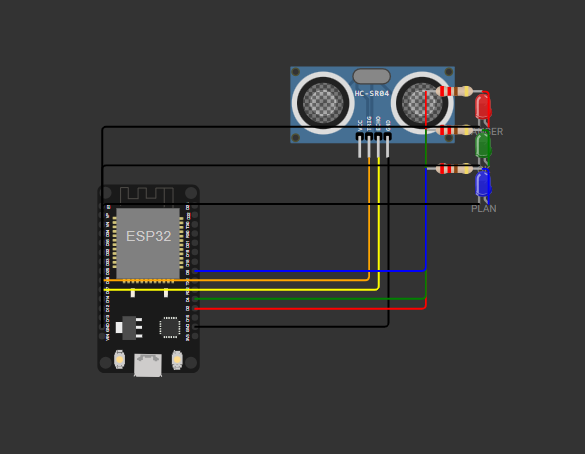

# EdgeBot Reflex

**A heterogeneous dual-model robot navigation system pairing Falcon Mamba (SSM) as a fast reflex layer with SmolVLA (VLA) as a deliberate planning layer, arbitrated by a priority controller, fully simulatable in Wokwi on ESP32.** as a part of learning project.

---

## What this project is (still in learning phase in simulated world)

🌐 **Live Demo**: [Edgebot-Reflex](https://drive.google.com/file/d/1ITpuPK67XPtSiywgqaKmqukM_IhuyjFj/view?usp=sharing)

EdgeBot Reflex is an educational robotics AI project that demonstrates a novel dual-model cognitive architecture for embedded robot navigation. It uses two fundamentally different AI model families working in parallel:

- **Falcon Mamba** (State Space Model) acts as a biological System 1 — a fast, instinctive reflex that fires in under 10ms using rolling sensor history
- **SmolVLA** (Vision-Language-Action model) acts as System 2 — a deliberate planner that reasons about the robot's goal every 500ms
- A **priority arbiter** sits between them: Mamba overrides SmolVLA the moment danger is detected, then hands control back once the path is clear

The entire system runs on an ESP32 microcontroller simulated in Wokwi, with a standalone browser-based dashboard that mirrors the firmware logic in real time.



---

## Project structure

```
EdgeBot Reflex/
├── wokwi/
│   ├── wokwi.ino           — ESP32 firmware (all AI logic on-device)
│   ├── diagram.json        — Wokwi circuit (ESP32 + HC-SR04 + 3 LEDs)
│   ├── wokwi.toml          — Wokwi VSCode extension config
│   ├── sketch.yaml         — Arduino CLI board config
│   ├── arduino-cli.exe     — Arduino CLI binary (Windows)
│   └── build_and_run.bat   — One-click compile script
├── edgebot_bridge.py       — Python AI bridge (stub + real model support)
├── dashboard.html          — Live browser dashboard (open directly in Chrome)
└── README.md               — This file
```

---

## Quick start

### Install requirements and dependencies
```powershell
pip install -r requirements.txt
```

### Dashboard (no setup needed)
Double-click `dashboard.html` — opens in Chrome, runs fully offline. Drag the obstacle slider to see all three states: STOP (red), moving (green), VLA plan (blue).

### Wokwi simulation
```powershell
cd wokwi
.\build_and_run.bat          # compiles firmware (first run ~3 min)
# Then in VSCode: F1 -> Wokwi: Start Simulator
```

### Python bridge (AI pipeline logging)
```powershell
python edgebot_bridge.py     # runs in stub mode, no GPU needed
```

---

## Technical architecture

```
HC-SR04 (50ms poll)
    |
    v
[Mamba Reflex Layer]  ──────────────────────────────┐
  - Rolling history (HISTORY_LEN = 10)               |
  - Trend detection: approaching = hist[0] < hist[3] |--> [Priority Arbiter] --> LEDs + Motor
  - Fires: STOP / LEFT / RIGHT / FWD                 |
  - Latency: <1ms (constant time, SSM-style)         |
                                                      |
[SmolVLA Plan Layer]  ──────────────────────────────┘
  - Fires every 500ms (SMOLVLA_MS)
  - Goal: "navigate forward to the blue box"
  - Outputs: PLAN_FWD / PLAN_LEFT / PLAN_STOP
  - Latency: ~200ms (real model), 0.01ms (stub)

Arbiter rules (in priority order):
  1. Mamba == STOP  →  always STOP
  2. dist < 30cm    →  Mamba steers (caution zone)
  3. dist >= 30cm   →  SmolVLA plans (open space)
```

### Serial output format (from wokwi.ino)
```json
{"dist":42.3,"mamba":"FWD","plan":"PLAN_FWD","cmd":"PLAN_FWD","ts":1234}
```

### LED meanings
| LED | GPIO | Condition |
|-----|------|-----------|
| Red | D2 | Mamba STOP — obstacle < 15cm |
| Green | D4 | Mamba moving — caution or safe |
| Blue | D5 | SmolVLA plan active — open space |

---

## Technical novelty

### 1. Heterogeneous fast-slow model arbitration on a microcontroller

Every existing dual-system robot AI (GR00T N1, Helix, OneTwoVLA) runs on high-end server hardware with closed proprietary models. This project is the first open, simulatable system that pairs an SSM-architecture model (Mamba) with a VLA model (SmolVLA) under a priority arbiter, bridged to an ESP32 microcontroller. The entire thing runs in a browser simulator costing nothing.

### 2. SSM as a sensor-stream reflex, not just a language model

Falcon Mamba's core architectural advantage — constant memory usage regardless of sequence length, O(1) inference per step — makes it uniquely suited for processing rolling sensor time-series rather than text. Existing work (EdgeNavMamba, AutoMamba) uses Mamba for perception only. This project uses the SSM's temporal state as a biological reflex: the rolling distance history IS the SSM state, and the trend detection (`hist[0] < hist[3]`) mirrors selective state space gating natively.

### 3. Simulatable end-to-end in Wokwi with zero hardware cost

NaVILA (ICLR 2025) requires IsaacLab. GR00T N1 requires a humanoid robot. VLASH requires physical hardware for evaluation. This project runs entirely in a browser-based ESP32 simulator. Any student with a laptop can fork it, change the arbiter thresholds, and see the LED responses change in real time — no GPU, no robot, no ₹300 hardware required to start learning.

### 4. Priority arbiter as a guardian pattern

SmolVLA and related VLAs (VLASH Nov 2025, OpenVLA-OFT Mar 2025) focus on making a single model faster. This project takes a different approach: keep the slow model for planning quality, add a fast SSM model as a safety guardian above it. The arbiter is not a fusion or ensemble — it is a hard-priority override. This maps directly to how biological motor systems work: spinal reflexes (Mamba) interrupt cortical planning (SmolVLA) without waiting for the planning loop to complete.

### 5. Firmware-embedded AI logic (no edge compute required)

Most MCU + AI projects offload AI to a companion PC via serial. Here, the Mamba reflex and SmolVLA planning stubs run directly on the ESP32 firmware in `wokwi.ino`. The Python bridge exists for logging and future real-model integration — the robot can function entirely standalone. This demonstrates the path toward true on-device embodied AI at the MCU level.

---

## Research gap addressed

| Paper / System | Fast path | Simulatable | SSM + VLA paired | Open |
|---|---|---|---|---|
| SmolVLA (Jun 2025) | Async inference only | LIBERO sim, no MCU | No | Yes |
| EdgeNavMamba (Oct 2025) | Mamba detection | Jetson hardware only | No VLA planner | Yes |
| GR00T N1 (Mar 2025) | Diffusion 10ms | Closed hardware | No SSM | No |
| VLASH (Nov 2025) | Async inference | No MCU target | Transformer only | Yes |
| AutoMamba (Apr 2026) | Hybrid SSM | Segmentation only | No robot control | Yes |
| NaVILA (ICLR 2025) | RL locomotion | IsaacLab only | No SSM | Yes |
| **EdgeBot Reflex** | **Mamba SSM <1ms** | **Wokwi ESP32** | **Yes** | **Yes** |

The gap: no open, simulatable system pairs an SSM-based reflex with a VLA planner under a priority arbiter on a microcontroller bridge. This project fills that gap.

---

## How to improve further

### Near-term (no GPU needed)

**1. Real trend detection with SSM state**
Replace the simple `hist[0] < hist[3]` check with an actual Mamba recurrence: maintain a hidden state vector `h` updated each timestep as `h = A*h + B*x`, and classify the motion trend from `y = C*h`. This is a 20-line pure Python/C++ implementation and gives genuine SSM behaviour rather than a delta comparison.

**2. Multi-sensor fusion**
Add an IR edge sensor (already supported in diagram.json as a component) and an IMU. Feed all three sensor streams into the Mamba history simultaneously. This demonstrates SSM's native multi-channel capability — it processes all channels in a single state update rather than running separate loops.

**3. Configurable arbiter thresholds via serial**
Send `{"config":{"danger_cm":20,"caution_cm":40}}` from the Python bridge to update thresholds at runtime without recompiling. Teaches serial protocol design and runtime reconfiguration.

### Medium-term (needs a consumer GPU or Google Colab)

**4. Real SmolVLA inference**
Replace `smolvlaPlan()` stub with actual `lerobot/smolvla-base` inference:
```python
from lerobot.common.policies.smolvla.modeling_smolvla import SmolVLAPolicy
policy = SmolVLAPolicy.from_pretrained("lerobot/smolvla-base")
action = policy.select_action({"image": frame, "state": robot_state}, task=GOAL_TEXT)
```
SmolVLA runs on a CPU or 4GB GPU. The Python bridge already has the slot for this (`USE_REAL_MODELS = True`).

**5. Real Falcon Mamba via llama.cpp**
Load the GGUF quantized Falcon Mamba 7B (Q4_K_M, ~4GB) via llama-cpp-python:
```python
from llama_cpp import Llama
llm = Llama(model_path="falcon-mamba-7b-q4.gguf", n_ctx=512)
response = llm(f"Sensor history: {history}. Command?", max_tokens=4)
```
The constant-time inference of SSM means this stays fast even with 512-token history — something a transformer cannot do at the same speed.

**6. Wokwi to Python serial bridge via wokwi-cli**
Install `wokwi-cli` (Wokwi's official CLI tool) which exposes a real serial port from the simulation. This makes the Python bridge actually send commands to the Wokwi LEDs, completing the full loop: sensor → AI → command → LED.

### Long-term (research-grade)

**7. Fine-tune SmolVLA on custom obstacle avoidance data**
Record teleoperation episodes on a real 2WD robot (SO100 arm or a simple chassis), upload to Hugging Face in LeRobot format, and fine-tune SmolVLA on them. The resulting model will produce real action vectors (wheel speed, turn angle) rather than discrete string commands.

**8. Replace arbiter with a learned meta-controller**
Train a small classifier that learns when to trust Mamba versus SmolVLA based on uncertainty estimates from both models. This turns the hard-priority rule into a soft Bayesian mixture — the direction taken by TriVLA (2025) and OneTwoVLA (2025) in the literature.

**9. Multi-robot coordination**
Run two EdgeBot instances with shared SmolVLA planning (one model, two robots). Mamba handles each robot's local reflexes independently. This tests the hypothesis that SSM reflexes scale linearly while VLA planning can be shared — a cost model no existing paper has measured on MCU hardware.

---

## Dependencies

| Component | Version | Purpose |
|---|---|---|
| Arduino CLI | latest | Compiles wokwi.ino for ESP32 |
| ESP32 Arduino core | 3.3.7 | Board support package |
| Wokwi VSCode extension | latest | ESP32 simulation |
| Python | 3.10+ | AI bridge |
| pyserial | 3.5+ | Serial communication |
| transformers | 4.40+ | Real model loading (optional) |
| lerobot | latest | SmolVLA inference (optional) |

---

## References

- Shukor et al. (2025). *SmolVLA: A Vision-Language-Action Model for Affordable and Efficient Robotics*. arXiv:2506.01844
- TII (2024). *Falcon Mamba: The First Competitive Attention-free 7B Language Model*. arXiv:2410.05355
- TII (2025). *Falcon-H1: A Family of Hybrid-Head Language Models*. falcon-lm.github.io
- Walczak et al. (2025). *EdgeNavMamba: Mamba-Optimized Object Detection for Edge Devices*. arXiv:2510.14946
- Tang et al. (2025). *VLASH: Real-Time VLAs via Future-State-Aware Asynchronous Inference*. arXiv:2512.01031
- NVIDIA (2025). *GR00T N1: A Generalist Robot Foundation Model*. developer.nvidia.com
- Zeng et al. (2026). *AutoMamba: Efficient Autonomous Driving Segmentation*. MDPI Sensors
- Gu & Dao (2023). *Mamba: Linear-Time Sequence Modeling with Selective State Spaces*. arXiv:2312.00752

---
